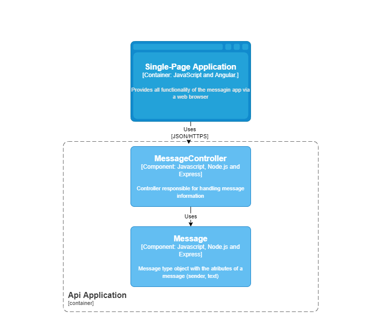
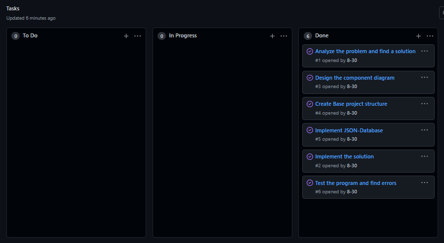

# PorthTestBackend

This following program is the backend solution for the PORTH test.

Contents
========
 * [Used Technologies](#technologies)
 * [Exercise Description](#description)
 * [Arquitecture](#arquitecture)
 * [Approach and Methodology](#approach-and-methodology)

## Technologies
========
 * Node
    * * Express 
    * * node-json-db

## Description
Hacer una página para dejar mensajes, donde puedas entrar por medio de un explorador web, dejar un mensaje y que quede persistente, si vuelves a entrar a la página, todos los mensajes que se hayan enviado deben seguir ahí.


## Installation

this program requires [Node.js](https://nodejs.org/) to run.

Clone the project:
```sh
git clone https://github.com/8-30/PorthTestBackend.git
```

Install the dependencies and devDependencies and start the server.
```sh
cd PorthTestBackend
npm install
npm start
```

to run the tests
```sh
npm run test
```

## Arquitecture

The functional structure of the program was modeled using the c4 model components diagram


## Approach and Methodology

For exercise development first I read the problem carefully until I found a possible solution, then I translated the solution in pseudo code to check if it would be useful, once my solution was verified I proceeded to design the component diagram and finally assemble the project structure and implement the solution.

I Manage all my tasks using a proyect within the github repository created for the exercise.


